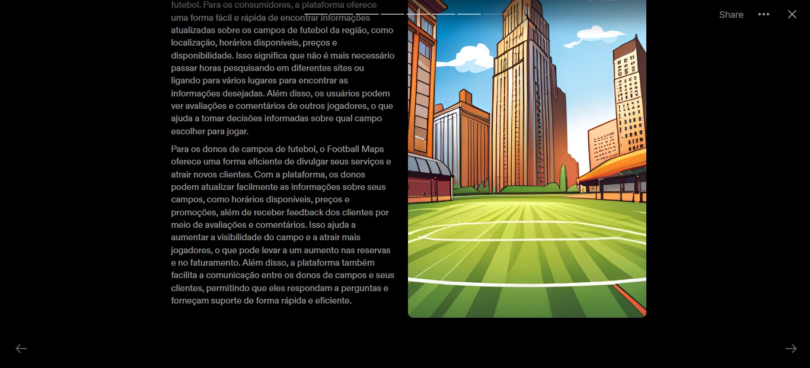

# Apresentação

## Título do Projeto

Football Maps

## Identidade Visual (Marca, Design)

## Conjunto de Slides (Estrutura)

 

## Vídeo de demonstração

https://drive.google.com/file/d/14lZmUq27C6vp-nXUrZ7kwScc9R0LhwaX/view?usp=sharing
